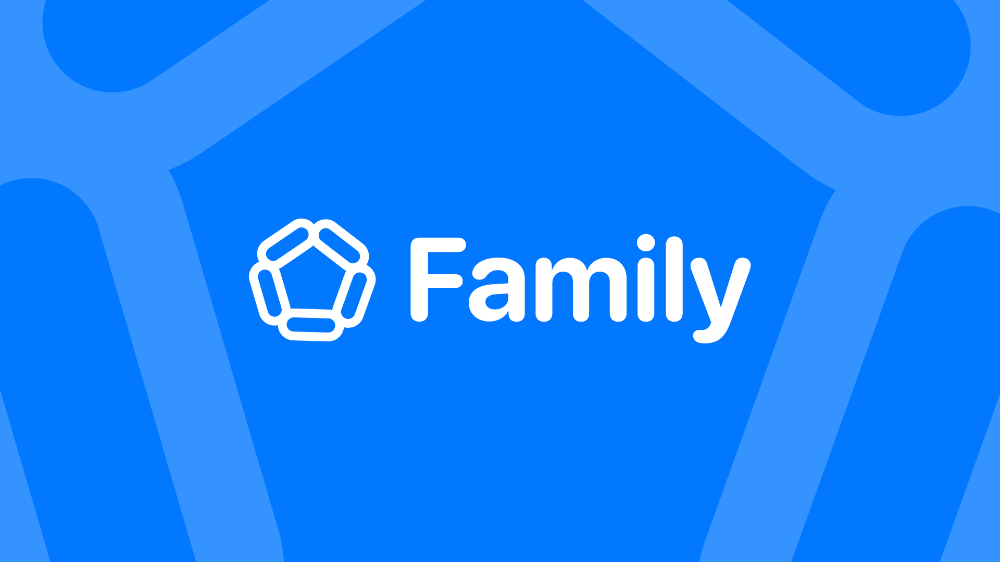

# 

Family is an AI-driven platform designed to assist young immigrant professionals in Sub-Saharan Africa in managing financial obligations to their families, commonly referred to as "black tax." Leveraging Web3 technologies, Family offers a seamless, cost-effective solution for budgeting, setting financial limits, and facilitating remittances, thereby enhancing financial well-being for users and their families.

## Problem Statement
Many young professionals in Sub-Saharan Africa are responsible for providing financial support to their families. This often leads to financial strain, making it challenging to save and invest for personal growth. Traditional remittance methods are costly, with fees averaging 7.8% per transaction . Additionally, managing multiple family requests and maintaining transparency can be overwhelming without structured tools.

## Tech Stack
- Next.js
- Alchemy AccountKit
- TailwindCSS
- Lucide
- Tanstack Query

## Features
- Link Wallet
- Add Family Members
- Set Financial Limits
- Remittance
- Chat with AI about your finances